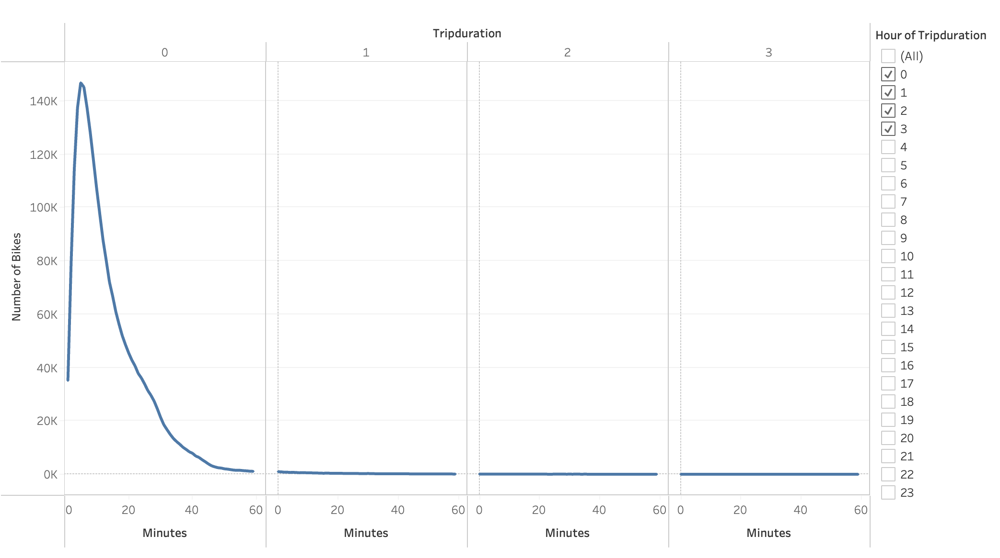
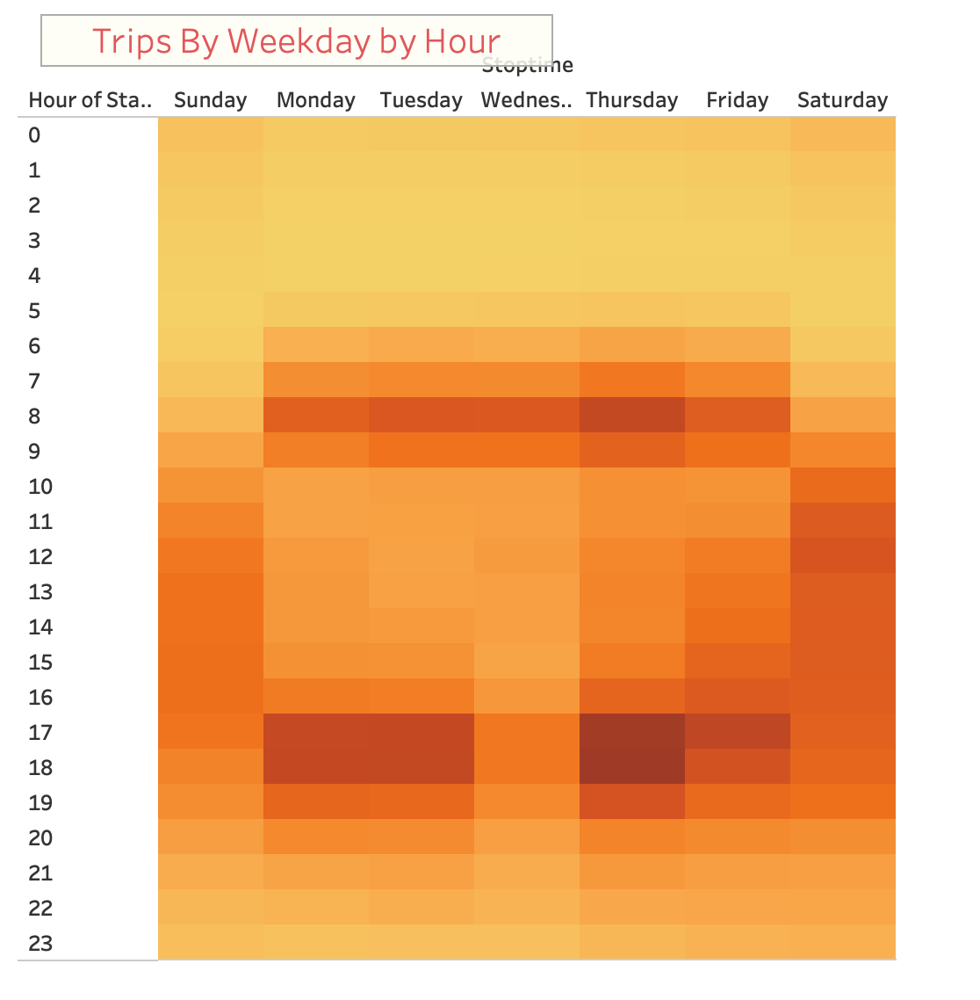
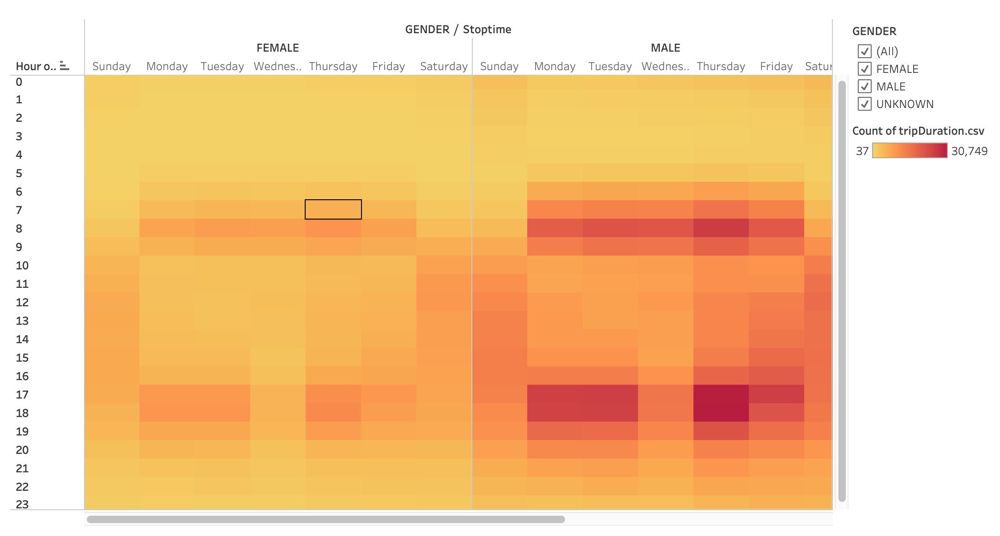
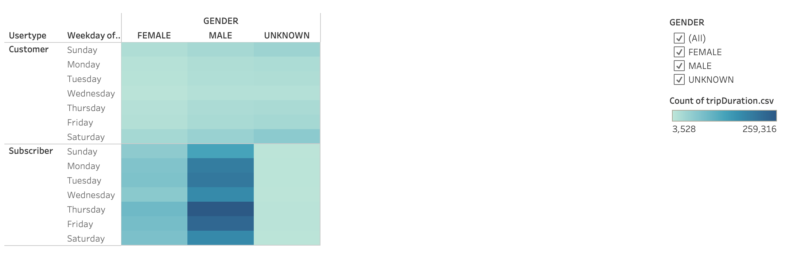
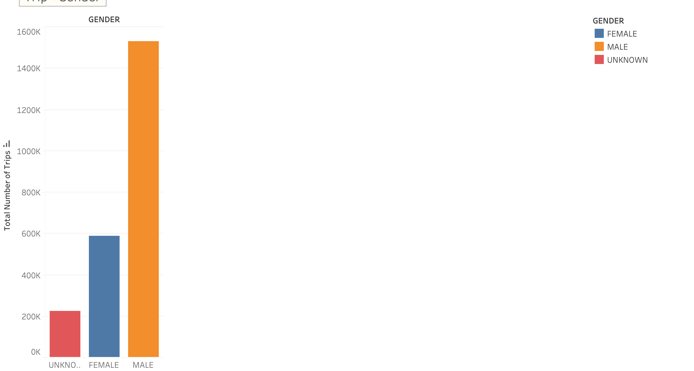
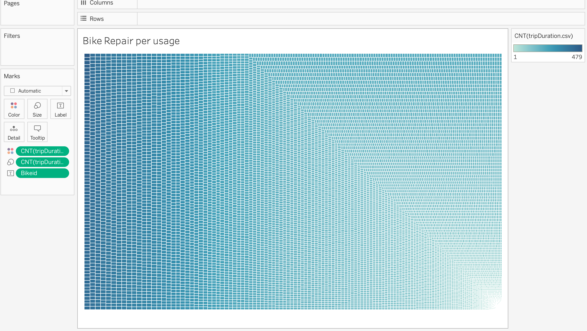
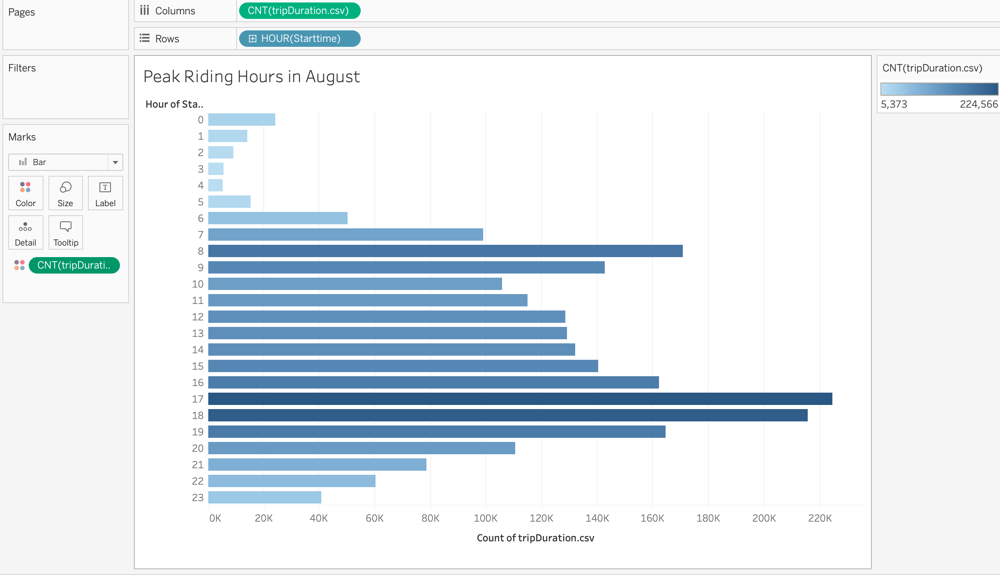

## Overview of the analysis 
 In this project we work with data visualization software called Tableau to present a business proposal for a bike-sharing company in Des Moines. The core issue we need to think about is what we absolutely need to know in order to create our bike-sharing program in Des Moines.
 
### Using Tableau, create visualizations that show:

* How long bikes are checked out for all riders and genders.
* How many trips are taken by the hour for each day of the week, for all riders and genders.
* A breakdown of what days of the week a user might be more likely to check out a bike, by type of user and gender.

## Results
* In this visualization, we graph the length of time that bikes are checked out for all riders.
There is a line graph displaying the number of bikes checked out by duration for all users, and the graph can be filtered by the hour.
Final results look similar to the following image:
 

* This is  Checkout Times by Gender Viz
In this visualization,  we graph the length of time that bikes are checked out for each gender.
There is a line graph displaying the number of bikes that are checked out by duration for each gender by the hour, and the graph can be filtered by the hour and gender.
Final results should look similar to the following image:

 

We create Trips by Weekday for Each Hour Viz
In this visualization, we will graph the number of bike trips by weekday for each hour of the day as a heatmap.

Our final results should look similar to the following image:

Create the Trips by Gender (Weekday per Hour) Viz
In this visualization, A heatmap is created showing the number of bike trips by gender for each hour of each day of the week, and the heatmap can be filtered by gender.

Create the User Trips by Gender by Weekday Viz
In this visualization, A heatmap is created showing the number of bike trips for each type of user and gender for each day of the week, and you can only filter by user and gender.

## Summary 

We Created Story to represent the analysis of CItibike Data in New york 

* CitiBike Analysis tells that more than 80% are Subscribers, with an ~19% or regular non-subscribers, that data creates a new need, such better user experiance interaction in the future.
* Total of 65% General Male use, 25% General Female with an Unknown gender that relies on non-subscribers users. 

* Inventory Use and Maintenance may be an issue in the future, locations are different time to time.

This is the link for tableau 
https://public.tableau.com/app/profile/shreya.akotiya/viz/Des-Moines-Bike-Sharing_16704666159540/Story-BikeSharing

<noscript></noscript><object class='tableauViz'  style='display:none;'><param name='host_url' value='https%3A%2F%2Fpublic.tableau.com%2F' /> <param name='embed_code_version' value='3' /> <param name='site_root' value='' /><param name='name' value='Des-Moines-Bike-Sharing_16704666159540&#47;Story-BikeSharing' /><param name='tabs' value='no' /><param name='toolbar' value='yes' /><param name='static_image' value='https:&#47;&#47;public.tableau.com&#47;static&#47;images&#47;De&#47;Des-Moines-Bike-Sharing_16704666159540&#47;Story-BikeSharing&#47;1.png' /> <param name='animate_transition' value='yes' /><param name='display_static_image' value='yes' /><param name='display_spinner' value='yes' /><param name='display_overlay' value='yes' /><param name='display_count' value='yes' /><param name='language' value='en-US' /></object>
                
